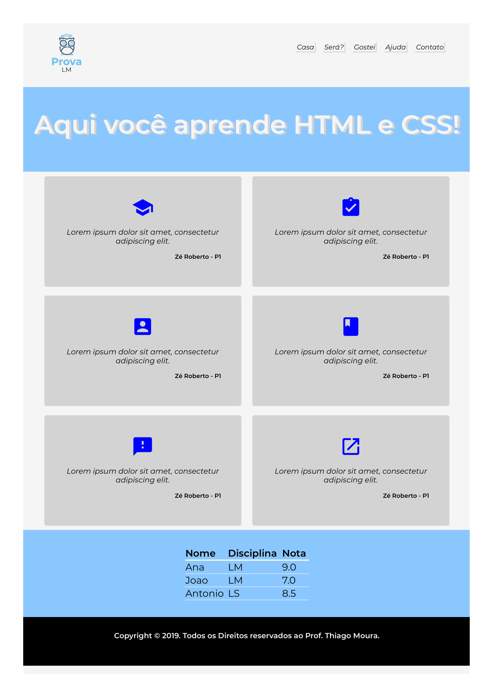
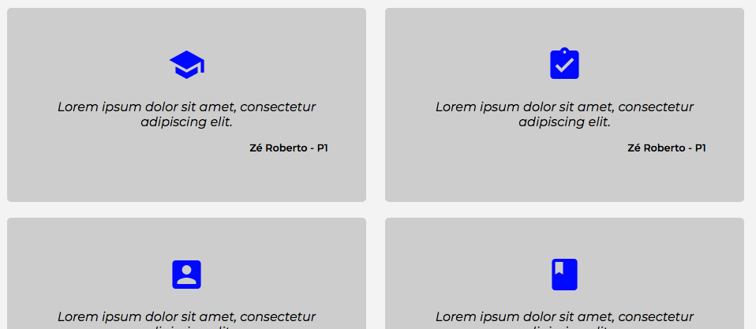
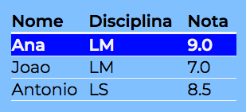

# Desafio: Site da Prova de LM

## Descrição
---

A estrutura básica do site se encontra no arquivo [site.zip](site.zip), e é exigida a criação de TODOS os componentes.

Ao final, o site terá o seguinte aspecto:

<br>

## Componentes
---

**COMPONENTE 1 -** Altere características gerais para toda a página.

No arquivo `main.css`, especificamente em `/* TODO COMPONENTE 1 */`, faça as seguintes alterações para toda a página:

* A cor de background de toda a página deve ser igual a `whitesmoke`;

* Margens iguais a `0` (zero);

* Fonte de toda a página igual a `Montserrat`, da família `sans-serif`.

* Não esquecer de adicionar ao arquivo `index.html` a url da fonte do [Google Fonts](https://fonts.google.com/), com os valores de peso e estilo: `400`, `400i`, `500`, `500i`, `600` e `600i`.

* Usar peso da fonte de `400` e tamanho de `1.1rem`;

* Adicionar a logo da página, arquivo `logo.png`, no comentário `<!-- Adicionar o LOGO -->` da página `index.html`

**COMPONENTE 2 -** Crie a barra de menu conforme ilustra a *Figura 1*: 

*Figura 1 - Barra de menu*<br>

As figuras 1a e 1b representam a barra de Menu:<br><br>

*Figura 1a*<br>
<br>
*Figura 1b*<br>


Contudo, considere os seguintes itens:

* No arquivo `index.html`, especificamente em `<!-- Adicionar o MENU -->` dentro do elemento `<nav>`, crie a lista de itens do menu usando a estrutura:

  ```html
  <ul>
    <li><a href="#">Casa</a></li>
    ...
    <li><a href="#">Contato</a></li>
  </ul>
  ```

* No arquivo `css/main.css`, especificamente em `/* TODO COMPONENTE 2 */`, adicione bordas (direita e baixo) para cada um dos elementos do menu. Bordas de cor `#d3d3d3` e espessura de `1.5px`. Tamanho da fonte de `1rem` com a fonte em itálico.

* Para cada um dos elementos do Menu, não esqueça de fazer ajustes de Box Model para que os elementos fiquem mais bem apresentados conforme as figuras 1a e 1b.

* Quando o mouse passar por cima dos elementos do menu, a fonte de ficar mais pesada com valor `600`.

**COMPONENTE 3 -** Estilize a área de testemunhos conforme ilustra a *Figura 2*:

*Figura 2 - Testemunhos*<br>


No arquivo `index.html`, especificamente em `<!-- Adicionar os Testemunhos -->`, acrescentar o HTML para os testemunhos.

```
<div class="testemunho">
  <div class="icone">
    <i class="material-icons">school</i>    
  </div>
    <div class="declaracao">
      <p>Lorem ipsum dolor sit amet, consectetur adipiscing elit.</p>    
    </div>
    <div class="aluno">
      <p>Zé Roberto - P1</p>
    </div>
</div>
```
* São 6 testemunhos na página e os ícones das tags `<i>` utilizados são:

  ```
  -> school
  -> assignment_turned_in
  -> account_box
  -> book
  -> feedback
  -> launch
  ```

No arquivo `css/main.css`, especificamente em `/* TODO COMPONENTE 3 */`, faça:

* Cada testemunho deve ter largura de `30%`, margem de `1%` e altura de `100%`. A cor de fundo é `#d3d3d3`. A borda tem curvatura de `5px`.

* Não esquecer de adicionar ao arquivo `index.html` a url do `Material Icon`.

* Os ícones devem ter tamanho de `3em` e cor azul.

* Os ícones são centralizados dentro de cada um dos testemunhos.

**COMPONENTE 4 -** Estilize a Tabela de Notas conforme ilustra a *Figura 3*:

*Figura 3 - Tabela de Notas*<br>


Contudo, considere os seguintes itens:

* Em `<!-- Adicionar Tabela de Notas -->`, no arquivo `index.html`, adicione a tabela de notas da *Figura 3*

* No arquivo `master.css`, em `/* TODO COMPONENTE 4 */`, as notas possuem cor de fundo igual a `#8CC7FF`. Toda a tabela tem tamanho da fonte de `1.3em`, com todo o texto interno a tabela alinhado à esquerda. A tabela é centralizada na página. As bodas da tabela possuem cor `whitesmoke`. A tabela tem largura de `30%`.

* A linha do título possui borda abaixo de `3px`. As outras linhas possuem borda abaixo de `1px`.

* Com exceção do título, quando o mouse estiver sobre alguma linha, a cor de fundo deve ser `blue` e o texto deve ficar em negrito.